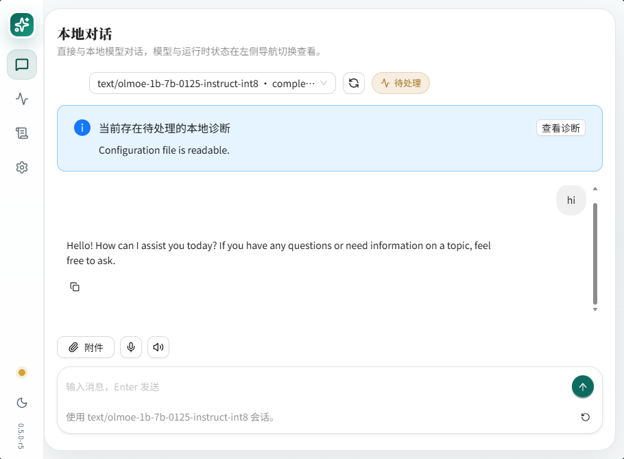

# Tomur

[中文](./README.md)

Tomur is a local AI runtime and developer workbench built with .NET 10 and C# for offline-first, privacy-sensitive, low-operations personal and team development environments. A single `tomur` process hosts the CLI, local HTTP service, OS service modes, model asset management, runtime diagnostics, and a Chat-first web workspace.

Tomur supports two local large-model runtime paths: managed model providers implemented by Tomur in pure C#, and a native runtime centered on llama.cpp. Both paths coexist and are selected explicitly from the model format, architecture, and local runtime conditions.

| Runtime path | Implementation | Capability boundary |
| --- | --- | --- |
| Pure C# managed models | `providers/Glm`, `providers/Olmoe` | Implements safetensors access, tokenization, tensor and quantization kernels, KV cache, attention, MoE routing, expert caching, and incremental generation in C# without a third-party inference dynamic library. Explicit GLM / MoE and OLMoE formats are connected and have targeted real-model inference evidence; the full protocol, performance, resource-release, and cross-platform matrices remain under roadmap validation. |
| llama.cpp native | `native/llama.cpp`, `native/llama.native`, `app/Inference` | Handles GGUF text generation and embeddings through Tomur-managed native bundles, hardware backend selection, GPU offload, and CPU fallback. It is the current default, validated path for text and embedding-compatible APIs. |

Both paths share the same model catalog, install manifests, session management, OpenAI / Ollama / Anthropic Messages-compatible APIs, runtime diagnostics, and web chat workspace. Model weights, SQLite data, logs, user files, and generated artifacts are managed consistently as local assets.

## 🧮 Pure C# Real-Model Evidence

Tomur's pure C# managed providers have loaded real GLM-4.7 and OLMoE models and completed non-streaming Web Chat conversations inside the single Tomur process, without an external inference process or third-party inference dynamic library. The screenshots below record real model responses; this evidence does not imply that the full protocol, performance, and cross-platform matrices are complete.

**GLM-4.7 Flash REAP 23B A3B** · [Validation record](./docs/r15-glm4-moe-lite-validation.md)


**OLMoE 1B-7B Instruct int8** · [Validation record](./docs/r15-olmoe-o5-validation.md)



## 🧭 Why Tomur

Tomur does not restrict local model execution to a single inference backend. Pure C# providers and the llama.cpp native runtime use consistent model, protocol, and diagnostic boundaries in the same local program:

1. 🧮 Select explicitly between pure C# GLM / OLMoE providers and the llama.cpp GGUF runtime from the model format and architecture without changing the service entry point.
2. 🔌 Use one local service for OpenAI, Ollama, and Anthropic Messages-compatible APIs.
3. 📦 Manage downloads, checksums, install manifests, and local visibility through one catalog and data directory.
4. 💬 Chat, upload attachments, and inspect the active provider, runtime, and session through one web workspace.
5. 🩺 Diagnose managed providers, native libraries, models, memory, ports, proxy settings, SQLite, and hardware through `tomur doctor`, runtime APIs, and the UI.
6. 🚀 Follow a self-contained, single-file, Native AOT-friendly release path with fewer local deployment prerequisites.

Tomur focuses on local AI runtime experience. It is not a multi-tenant server product, enterprise administration shell, or complex workflow governance platform.

## 💬 Community

Join the Tomur WeCom group to discuss usage, local AI practices, and project development.


## 🚀 Quick Start

Show available commands:

```powershell
tomur --help
```

Start the local service and open the workspace:

```powershell
tomur open
```

Prepare the native runtime and install the recommended model packages:

```powershell
tomur native prepare
tomur pull recommended
```

Run the local HTTP API service:

```powershell
tomur serve --open
```

When developing from source, run the main application project directly:

```powershell
dotnet run --project app -- --help
dotnet run --project app -- serve --open
```

The default local service URL is `http://127.0.0.1:5137`.

## 🧩 Target Capabilities

1. 💬 Local text generation through both pure C# providers and the llama.cpp native runtime.
2. 🧮 Pure C# GLM / MoE and OLMoE loading, quantization, caching, and generation through `providers/Glm` and `providers/Olmoe`.
3. ⚙️ GGUF text generation, embeddings, hardware acceleration selection, and CPU fallback through llama.cpp.
4. 🧠 Local embeddings and reranking.
5. 🔌 OpenAI-compatible HTTP API.
6. 🔁 Ollama-compatible HTTP API.
7. 🧩 Anthropic Messages-compatible endpoints required by Claude Code.
8. 📦 Model catalog, download, verification, and local asset management.
9. 🩺 Runtime diagnostics for CPU, memory, disk, proxy, ports, models, managed providers, and native libraries.
10. 🎛️ Multimodal native runtimes for Whisper, OCR native, stable-diffusion.cpp, and llama.cpp TTS / GGUF TTS.
11. 🖥️ System service mode.
12. 🧑‍💻 React + Ant Design X web workspace.

Tomur does not fabricate inference results when the local runtime is unavailable. Missing models, unavailable native runtime or managed providers, damaged bundle assets, context length limits, capability mismatches, and insufficient memory are reported as diagnosable errors through the API, CLI, and UI.

## 🔌 API Examples

Health check:

```powershell
curl.exe http://127.0.0.1:5137/health
```

List locally visible models:

```powershell
curl.exe http://127.0.0.1:5137/v1/models
```

Call the OpenAI-style chat API:

```powershell
curl.exe http://127.0.0.1:5137/v1/chat/completions `
  -H "Content-Type: application/json" `
  -d '{
    "model": "qwen35-9b-q4km",
    "messages": [
      { "role": "user", "content": "Introduce Tomur in one sentence." }
    ],
    "stream": false
  }'
```

Call the Ollama-style chat API:

```powershell
curl.exe http://127.0.0.1:5137/api/chat `
  -H "Content-Type: application/json" `
  -d '{
    "model": "qwen35-9b-q4km",
    "messages": [
      { "role": "user", "content": "List the current runtime status." }
    ],
    "stream": false
  }'
```

Actual model IDs come from the local install manifest and model directory. Inspect them with:

```powershell
tomur list
tomur ps
tomur list --catalog
```

## 🏗️ Architecture Overview

Tomur keeps a single-process product boundary. The repository is organized around the application host, managed model providers, native runtimes, the web workspace, and validation projects:

```text
Tomur/
  Tomur.slnx
  app/
    Tomur.csproj
    Program.cs
    Agents/
    Api/
      Anthropic/
      Ollama/
      OpenAI/
    Assets/
    Cli/
    Config/
    Conversations/
    Diagnostics/
    Hardware/
    Inference/
    Models/
    Multimodal/
    Native/
    Providers/
    Runtime/
    Serialization/
    Services/
    Storage/
    wwwroot/
  providers/
    Abstractions/
      Tomur.Providers.Abstractions.csproj
    Glm/
      Tomur.Providers.Glm.csproj
    Olmoe/
      Tomur.Providers.Olmoe.csproj
  tests/
    Tomur.Providers.M1.Tests/ ... Tomur.Providers.M13.Tests/
    Tomur.Providers.Olmoe.Tests/
  native/
    bundle.manifest.json
    llama.cpp/
    llama.native/
    whisper.cpp/
    whisper.native/
    paddleocr/
    ocr.native/
    stable-diffusion.cpp/
    stable-diffusion.native/
    tts.native/
  web/
    package.json
    src/
      app/
      components/
  docs/
  README.md
  README.en.md
  ROADMAP.md
  CHANGELOG.md
```

`app/Tomur.csproj` is the only product host. It contains the CLI, ASP.NET Core local HTTP API, OS service and tray startup, model and session management, runtime diagnostics, and web static asset hosting. `Program.cs` only owns process entry, top-level command dispatch, and global help. `app/Cli/ServeCommand.cs` assembles the shared local service host, while `app/Api/` provides Tomur endpoints and the OpenAI, Ollama, and Anthropic Messages compatibility surfaces.

`providers/Abstractions` contains the model descriptors, manifests, inference contracts, and session contracts shared by the host and managed providers. `providers/Glm` and `providers/Olmoe` implement pure C# model loading and generation; OLMoE currently also reuses the managed tensor, kernel, and storage foundations from the GLM project. The host directly references and registers both providers, then selects one explicitly from the local model format, architecture, and manifest. Unmatched GGUF text and embedding models continue through llama.cpp. Provider class libraries do not expose a separate process or HTTP API.

`native/` contains upstream source trees, Tomur CMake adapter projects, and the release `bundle.manifest.json`. `app/Native/` prepares the bundle and resolves and loads dynamic libraries, `app/Inference/` owns llama.cpp text sessions, and `app/Multimodal/` connects Whisper, OCR, stable-diffusion.cpp, and GGUF TTS. Pure managed providers coexist with these runtimes and do not replace the existing native paths.

`web/` uses React, TypeScript, Vite, and Ant Design X. Its build output is written to `app/wwwroot`, embedded, and served by the Tomur local HTTP service. The M1-M13 projects under `tests/` cover staged GLM provider contracts and regressions, while OLMoE has a dedicated test project; these projects belong only to the validation surface and do not create product services.

## 📁 Local State

Tomur stores configuration, models, runtime cache, SQLite data, logs, and generated artifacts under a stable data directory.

| Platform | Default data directory |
| --- | --- |
| Windows | `%LOCALAPPDATA%\Tomur` |
| Linux | `~/.local/share/tomur` |
| macOS | `~/Library/Application Support/Tomur` |

Key paths inside the data directory:

| Path | Purpose |
| --- | --- |
| `<data>/config/tomur.json` | Local configuration file |
| `<data>/tomur.db` | SQLite database |
| `<data>/runtime` | Versioned native runtime cache |
| `<data>/models` | Local model directory and install manifest |
| `<data>/logs` | Log directory |

Override the data directory with `--data-dir <path>` or `TOMUR_DATA_DIR`. If the configuration file is damaged, the diagnostic flow moves it to `.damaged-<timestamp>` and writes a default configuration.

## 📦 Runtime Assets

Tomur release artifacts should carry the required C++ native dynamic libraries and prepare them into Tomur's managed runtime directory on first run or version change. Model weights are not packaged into the executable; `tomur pull` downloads them into the local model directory and records them in `<data>/models/models.manifest.json`.

The managed provider set is determined at build time by the project references in `Tomur.csproj`. The GLM and OLMoE providers are registered statically through `ModelProviderRegistry` when the process starts; Tomur does not discover assemblies from an external `providers/` directory. Model manifests still declare the provider, architecture, and format. If a build does not contain the selected provider or model assets are incomplete, the catalog, APIs, doctor, and Runtime UI return explicit diagnostics. Native AOT and non-AOT releases use the provider set included by their respective builds, without removing or downgrading existing native providers.

`tomur native prepare` extracts or repairs the native runtime bundle. `tomur doctor` checks runtime, models, SQLite, ports, proxy, and hardware status. Missing or damaged native libraries are reported through clear CLI, API, and UI diagnostics.

Windows x64 native build entry point:

```powershell
tomur native build --rid win-x64 --backend all
tomur native build --rid win-x64 --backend vulkan
tomur native build --rid win-x64 --backend sycl
tomur native build --rid win-x64 --backend openvino
tomur native build --rid win-x64 --backend intel
```

Use `--backend cpu` or `--backend cuda13` to build a single variant. `--backend intel` builds the llama.cpp `sycl`, `openvino`, and `vulkan` dynamic backend entries. When an Intel backend is missing or no device can be enumerated, Tomur keeps CPU fallback and reports the reason through `tomur doctor`, `/api/runtime/status`, and the Web Runtime panel.

## 🙏 Acknowledgements

Tomur's pure C# GLM / MoE providers were inspired by the design ideas and engineering exploration in [JustVugg/colibri](https://github.com/JustVugg/colibri), especially its pure C approach to MoE model execution, streaming routed experts from disk, and managing resident weights and multi-level caches. We thank JustVugg for making this work public. Tomur implements the related capabilities independently in C#, and Colibri is not a Tomur runtime dependency.

## 📄 License

Tomur is released by IoTSharp contributors under the [Apache License 2.0](./LICENSE). This license covers source code owned by IoTSharp contributors in this repository; third-party dependencies, native runtimes, optional accelerator libraries, and model assets remain subject to their respective upstream terms and are not relicensed by the Tomur license. See [NOTICE](./NOTICE) and [THIRD_PARTY_NOTICES.md](./THIRD_PARTY_NOTICES.md) for attribution and distribution boundaries.

## 🗺️ Roadmap

Long-term stage plans, completion scope, and follow-up work are maintained in [ROADMAP.md](./ROADMAP.md); completed history is maintained in [CHANGELOG.md](./CHANGELOG.md). This README keeps the project positioning, usage path, and current boundaries concise.
