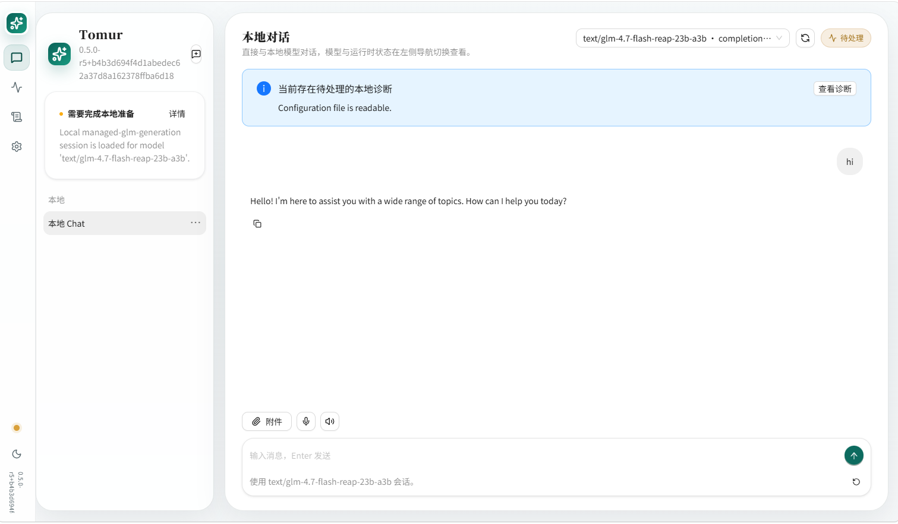

# R15 GLM4 MoE Lite 异机验证

状态：进行中

本文定义 `managed-glm` 对 `glm4_moe_lite` 的异机转换与 smoke 边界。完整 GLM-4.7 已完成转换、资产校验、provider 加载和 readiness；生产 attention 默认切换到 Absorbed MLA 后，固定 1-token completion 已返回 HTTP 200 和真实 token，并完成一次 Web Chat 非流式真实对话和一次活动请求 unload 取消。该结果证明最短真实推理链路、单次 Chat 链路与定向取消路径通过，不代表性能可用，也不替代完整 Chat、streaming、Anthropic、重复取消/unload 和吞吐矩阵。实时服务器状态、下载任务和接手步骤见 [R15 远程 GLM 验证交接记录](./r15-remote-validation-handoff.md)。

## 固定输入

| 项目 | 值 |
| --- | --- |
| 源模型 | `cerebras/GLM-4.7-Flash-REAP-23B-A3B` |
| Hugging Face revision | `da315d1a734ba8501a014eb3ff53ca38cbcf63e5` |
| 模型类型 | `glm4_moe_lite` |
| 参数规模 | 23B total / 3B active，47 layers，48 routed experts，top-k 4 |
| License | MIT |
| 转换器参考 commit | `748787c3afa8ab336bb51bf616f212a04f209bba` |
| 转换布局 | int8 embedding/lm_head；int4 dense/shared/routed expert；`packed-offset` + `*.qs` |

## 2026-07-16 P0 MLA 验证

P0 只调整 MLA 默认执行模式，reference 路径继续保留为显式 oracle/诊断入口。验证结果如下：

1. 本机 `Tomur.Providers.M7.Tests` 通过 7/7，覆盖生产入口默认模式、tiny attention oracle、reference/absorbed 数值误差、prefill/decode、compressed KV 和回滚边界。
2. 本机 `Tomur.Providers.M9.Tests` 通过 6/6，覆盖完整 `ManagedForwardContext` teacher forcing、prefill、greedy decode 和 session 行为。
3. Linux 验证机的隔离源码副本通过 M7 6/6 与 M9 6/6；Release provider SHA-256 为 `4f4f251b438ff0b0695f8b561de108b5e0cffc837e2a1609972e3ebb6659f620`。
4. 固定请求 `prompt="a"`、`max_tokens=1`、`temperature=0` 在 Reference MLA 基线耗时 `186.596971s`，在保留同一 AVX2 packed int4/int8 kernel 的 Absorbed MLA 路径耗时 `26.595764s`，端到端改善 `7.02x`，耗时降低 `85.7%`。
5. 两次请求均返回 3 prompt tokens、1 completion token 和文本 `" br"`。Absorbed 请求的 forward active elapsed 为 `24.6s`，完成后 session 为 `busy=false`、`forward_verified=true`。
6. 最终证据位于 `/data/tomur/smoke/glm47-p0-absorbed-20260716-1445c/service`。该请求累计 464 次 expert disk reads、2,198,929,408 bytes，cache hit/miss/eviction 为 94/464/188；expert cache、批量 prefill 和 kernel 后续优化仍需独立验证。
7. P0 前的一次长请求通过 unload 取消后返回结构化 `503 session_unloaded`，正式 unload 约耗时 `1.58-2.48s`，服务保持可响应。该结果只完成一次定向取消/unload，不替代重复资源释放矩阵。

### Web Chat 非流式真实对话

以下截图记录 Tomur Web Chat 选择 `text/glm-4.7-flash-reap-23b-a3b` 后完成一次英文非流式真实对话。左侧运行时状态显示 `managed-glm-generation` session 已加载，用户输入 `hi` 后模型返回英文回复。该证据只覆盖单次 Web Chat 请求，不代表 streaming、Anthropic、中文、代码、取消或持续吞吐矩阵已经完成。



源权重共 `45,993,145,128` bytes（42.834 GiB）：

| 文件 | bytes | SHA-256 |
| --- | ---: | --- |
| `model-00001-of-00009.safetensors` | 5,363,354,288 | `b230d13ddfce3d53835b9b3b97c7219321be8e9f3465d84de787e4a6b6459720` |
| `model-00002-of-00009.safetensors` | 5,364,819,824 | `642adcd78a9d886f6300135a629cf74245996e5fc58ff10add693f0e43b5dd90` |
| `model-00003-of-00009.safetensors` | 5,365,136,840 | `6d32b9b4173bb8179e25a66ce0c70ff3f10684d9120ffa7ba0ffb38011437431` |
| `model-00004-of-00009.safetensors` | 5,364,820,504 | `9c82d622e113410c959e165e698e87a9d0fd3730a9e99be5acc610ee747dff73` |
| `model-00005-of-00009.safetensors` | 5,365,136,840 | `d160458b9dab6c72f379948724d582981a78ce5d964db308f95046c3cacd7b64` |
| `model-00006-of-00009.safetensors` | 5,364,820,504 | `0f1259f8393bdd3cec42f1eb6ab8b91fa5b1693a69dd0a401a27de47e5c16ef4` |
| `model-00007-of-00009.safetensors` | 5,365,136,840 | `bd83eec1cccf4bf3d3f4af0e61d0035d9c395fbf18849baf7f7d01366ee29b95` |
| `model-00008-of-00009.safetensors` | 5,364,820,488 | `dff1b3e5fd3dcd5a6c2f01342b0e2ae609a022b73d4d8fce8555e26bc253e0f0` |
| `model-00009-of-00009.safetensors` | 3,075,099,000 | `c8233be0ef2f6327e34b9ce892dc141c9a9aa86f784fb616d1587557fa88cc4e` |

转换前必须逐项核对 size 与 SHA-256。任一 shard 不匹配时停止，不生成可用清单。

## 转换步骤

验证机应使用独立源目录、输出目录和 Tomur data directory。建议预留至少 80 GiB 可用空间；如使用转换器的远程逐 shard 模式，还必须固定源 revision 或在记录中保存开始时解析到的 revision。

```powershell
git clone https://github.com/JustVugg/colibri.git D:\work\colibri
git -C D:\work\colibri checkout 748787c3afa8ab336bb51bf616f212a04f209bba

huggingface-cli download cerebras/GLM-4.7-Flash-REAP-23B-A3B `
  --revision da315d1a734ba8501a014eb3ff53ca38cbcf63e5 `
  --local-dir D:\models\glm4-reap-source

python D:\work\colibri\c\tools\convert_fp8_to_int4.py `
  --indir D:\models\glm4-reap-source `
  --outdir D:\smoke\tomur-glm4\data\models\text\glm-4.7-flash-reap-23b-a3b `
  --ebits 4 --io-bits 8 --xbits 4 --n-layers 47
```

输出目录必须增加：

```json
{
  "schema_version": 1,
  "provider": "managed-glm",
  "architecture": "glm4_moe_lite",
  "display_name": "GLM 4.7 Flash REAP 23B A3B",
  "config": "config.json",
  "tokenizer": "tokenizer.json",
  "tensor_pattern": "out-*.safetensors",
  "quantization": "int4",
  "quantization_layout": "packed-offset",
  "capabilities": ["completion", "chat"]
}
```

转换完成后记录每个输出 shard 的 bytes 与 SHA-256、总大小、tensor 数量和转换 wall time。源目录可以在 checksum、转换和产物记录全部完成后清理。

## 代码与模型 smoke

以下命令仅在验证机执行；本机未运行：

```powershell
dotnet build Tomur.slnx --no-restore
dotnet test Tomur.slnx --no-restore

$env:TOMUR_PROVIDER_PATH = "<repo>\providers\Glm\bin\Debug\net10.0"
dotnet run --project app\Tomur.csproj -- serve `
  --data-dir D:\smoke\tomur-glm4\data `
  --urls http://127.0.0.1:5174
```

必须覆盖：

1. `tomur list`、`GET /v1/models` 与 `GET /api/tags` 只在清单、config、tokenizer、全部 tensor 和 scale 校验通过后展示模型。
2. manifest architecture 与 `config.json:model_type` 不一致时返回 `managed_model_invalid`。
3. OpenAI Chat 非流式与 SSE、Ollama Chat、Anthropic Messages 均使用 GLM4 MoE Lite prompt；至少记录一个中文、一个英文和一个代码请求。
4. 默认非 thinking prompt 使用 `[gMASK]<sop>` 后换行、assistant `</think>` closure；tool 消息使用 `<tool_response>` 包装。
5. context 超限、取消、损坏 shard 和缺少 `*.qs` 必须返回结构化诊断，不生成 token。
6. unload 后释放 session、shard handles、resident buffers 与 expert cache，服务仍可响应健康检查。

## 证据字段

异机记录至少包含 Tomur commit、OS/RID、CPU、RAM、存储介质、.NET SDK、隔离 data directory、模型 revision、转换器 commit、输出 checksum、context、resident/KV/scratch/expert-cache bytes、首次加载时间、首 token、token/s、expert hit/miss/eviction、disk bytes/wait 和进程峰值内存。

当前可以声明完整 GLM-4.7 的最短非流式 completion、一次 Web Chat 非流式对话和一次活动请求取消/unload 已通过真实链路，并形成 P0 前后对照证据。完整协议矩阵、自然语言质量、持续 decode 吞吐、cold/warm/hot cache、重复取消/unload、峰值内存和跨平台证据仍未完成，因此不能声明性能可用或完整验证通过。
